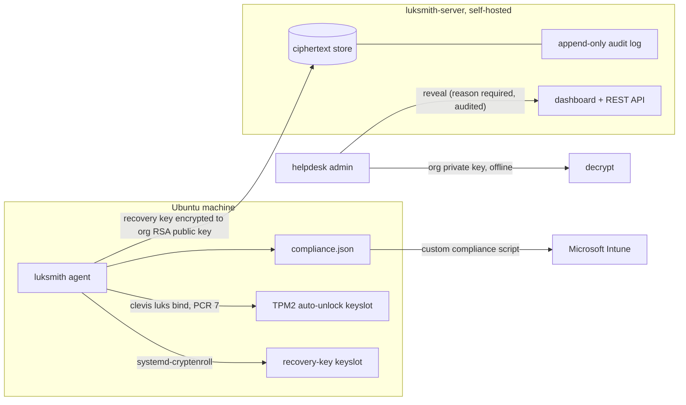

# 🔑 luksmith

**Org-grade disk encryption management for Ubuntu — BitLocker + Intune parity for LUKS.**

BitLocker gives Windows fleets TPM auto-unlock, recovery keys escrowed to a portal, helpdesk retrieval with audit trails, and compliance reporting. Linux fleets get LUKS — excellent encryption, and none of the management. Every TPM tool stops at *"here's your recovery key, store it somewhere safe"*; every escrow tool ignores the TPM entirely; the only mainstream product that escrows LUKS keys at all paywalls it.

luksmith is the missing piece: a zero-dependency agent + self-hosted portal that does what BitLocker does, for Ubuntu.

| Capability | BitLocker + Intune | Fleet (Premium 💰) | clevis | sectpmctl | Ubuntu snap-FDE | **luksmith** |
|---|---|---|---|---|---|---|
| TPM2 auto-unlock on startup | ✅ | ❌ | ✅ | ✅ | ✅ | ✅ |
| Recovery key auto-escrow to portal | ✅ | ✅ | ❌ | ❌ | ❌ | ✅ |
| Server never sees plaintext key | ❌ | ❌ | — | — | — | ✅ (E2E RSA-OAEP) |
| Escrow-first gating (no unlock until key is safe) | ✅ | ❌ | ❌ | ❌ | ❌ | ✅ |
| Boot classification (TPM ok vs fallback typed) | ✅ | ❌ | ❌ | ❌ | ❌ | ✅ |
| PCR-drift detection + auto re-enroll | ✅ | ❌ | manual | ✅ | ✅ | ✅ |
| Audited key retrieval with mandatory reason | ✅ | partial | — | — | — | ✅ |
| Works on stock Ubuntu (GRUB + initramfs-tools) | — | ✅ | ✅ | ✅ | new installs only | ✅ |
| Free & open source | ❌ | ❌ | ✅ | ✅ | ✅ | ✅ |

## Why this exists

Three facts make this project necessary:

1. **Stock Ubuntu can't TPM-unlock its root disk with systemd alone.** `systemd-cryptenroll --tpm2-device=auto` *succeeds*, then the boot prompt ignores it — Ubuntu's initramfs-tools doesn't understand TPM2 tokens ([LP #1980018](https://bugs.launchpad.net/ubuntu/+source/cryptsetup/+bug/1980018), deliberately unfixed). Working auto-unlock on stock installs needs clevis plus an initramfs fix luksmith applies for you.
2. **You cannot store Linux keys in Intune/Entra.** The BitLocker key store is read-only via Graph; its write path is welded to the Windows MDM stack. Intune can only *check* Linux encryption compliance. So the portal has to be yours — luksmith ships it.
3. **Nobody combines enrollment and escrow.** Fleet escrows but won't touch the TPM (and it's Premium-only). clevis/sectpmctl do TPM but have no server. luksmith does both, in the right order.

## Architecture



**The enrollment order is the product.** `luksmith enroll`:

1. Generates a recovery key into a real LUKS2 keyslot (`systemd-cryptenroll --recovery-key`) — it works at any passphrase prompt, on any Ubuntu.
2. Encrypts it to your org's RSA public key (`openssl pkeyutl`, RSA-OAEP/SHA-256) and escrows the **ciphertext** to the portal. The server, the network, and a database backup thief never see a usable key; decryption requires the org private key, which stays with your admins.
3. **Only after escrow succeeds** does it bind TPM auto-unlock (BitLocker's escrow-first semantics — a machine can never end up conveniently unlocked but unrecoverable).
4. Records a PCR 7 baseline for drift detection.

After every boot, `luksmith verify` (systemd timer) classifies the boot — did the TPM unlock it, or did a human have to type a secret? — by test-unsealing against *current* PCRs, detects PCR drift, re-binds automatically (`clevis luks regen`), and checks in to the portal.

## Quickstart

### 1. One-time org keypair (on an admin workstation, NOT the server)

```bash
openssl genpkey -algorithm RSA -pkeyopt rsa_keygen_bits:4096 -out org_private.pem
openssl pkey -in org_private.pem -pubout -out org_public.pem
```

`org_private.pem` decrypts every escrowed key — keep it offline (password manager / HSM). Only `org_public.pem` gets distributed.

### 2. Portal

```bash
git clone https://github.com/cdmx-in/luksmith && cd luksmith
LUKSMITH_ADMIN_TOKEN=$(openssl rand -hex 32) \
LUKSMITH_ENROLL_SECRET=$(openssl rand -hex 16) \
docker compose up -d
```

Two more ways to run it, same API and database either way:
- **Static binary** (Go, no runtime at all): grab `luksmith-server-linux-amd64` + `luksmith-ui.tar.gz` from [releases](https://github.com/cdmx-in/luksmith/releases), `./luksmith-server-linux-amd64 --ui-dir dist --admin-token ... --enroll-secret ...`
- **Zero-dependency Python**: `python3 server/luksmith_server.py --admin-token ... --enroll-secret ...`

Put TLS in front (Caddy/nginx) or pass `--tls-cert/--tls-key`. The web portal at `https://your-server:8443/` is a React admin UI — token login, device fleet with boot/escrow health, audited key reveals, rotation, audit log.

### 3. Agent (each Ubuntu 22.04/24.04 machine, disk already LUKS-encrypted)

```bash
wget https://github.com/cdmx-in/luksmith/releases/latest/download/luksmith.deb
sudo apt install ./luksmith.deb
sudo luksmith enroll --server https://YOUR-PORTAL:8443 \
  --org-pubkey /etc/luksmith/org_public.pem --enroll-secret YOUR-SECRET
```

(From a checkout instead: `sudo ./install.sh` does the same.)

Enroll prompts once for the existing LUKS passphrase, then: recovery key created → escrowed → TPM auto-unlock bound → PCR baseline stored. Next reboot: no passphrase prompt.

**Recovering a machine** (lost laptop, departed employee, broken TPM): click *Reveal* in the portal (reason mandatory, audited), decrypt on the admin workstation with `org_private.pem`, type the recovery key at the normal boot prompt.

### Intune integration

Intune can't hold the key, but it can *enforce that escrow happened*:

1. Upload [`integrations/intune/luksmith-discovery.sh`](integrations/intune/luksmith-discovery.sh) as a Linux custom-compliance script (it runs unprivileged and reads only the non-secret `compliance.json`).
2. Attach [`luksmith-compliance-rules.json`](integrations/intune/luksmith-compliance-rules.json) to a compliance policy.
3. Devices without an escrowed key go non-compliant → Conditional Access does the rest. Helpdesk pivots from the Intune device page to your luksmith portal for the actual key.

## TPM modes

| Mode | When | How |
|---|---|---|
| `--mode clevis` (default) | Stock Ubuntu 22.04/24.04 (GRUB + initramfs-tools) | `clevis luks bind` on PCR 7 + the `tss`-user initramfs hook luksmith installs (works around the packaging gap that breaks TPM at early boot) |
| `--mode systemd` | dracut installs, Ubuntu ≥25.10, or non-root data volumes | Native `systemd-cryptenroll --tpm2-device=auto --tpm2-pcrs=7` |
| `--no-tpm` | Servers/VMs without TPM, or escrow-only rollouts | Recovery key + escrow only; passphrase prompt remains |

PCR policy is **7 only** (Secure Boot certificates) by default — routine kernel/GRUB updates don't change it, so no recovery prompts after `apt upgrade`. What *does* change it (Secure Boot toggles, dbx/firmware updates): `luksmith check-updates` flags pending fwupd updates marked `affects-fde` before you reboot, and `verify` re-binds automatically after.

## Security model

- **E2E encryption:** keys are encrypted on the device to the org public key; the server stores ciphertext only. Compromising the server or its backups yields nothing usable without the org private key.
- **Escrow-first:** TPM convenience is never enabled before the recovery path is durably stored.
- **Audited retrieval:** every reveal requires a reason and lands in an append-only audit log; so do enrollments and escrows.
- **Honest ceiling:** TPM auto-unlock with an *unsigned* initramfs (any GRUB-based Ubuntu, luksmith or not) is weaker than BitLocker's signed-boot-chain binding — an attacker with disk access can tamper with the initramfs. This is Ubuntu's argument in LP #1980018 and it's fair. Mitigations: TPM+PIN (`systemd` mode on 24.04+ supports `--tpm2-with-pin`), or accept that the threat model is "lost/stolen laptop, powered off," which PCR-7-bound TPM unlock handles. The recovery key + escrow layers are unaffected either way.

## What CI proves

Every push exercises the full chain on a real LUKS2 volume: format → enroll → escrow → admin reveal → RSA decrypt → **the recovered key actually opens the volume** (`cryptsetup open --test-passphrase`) → admin-triggered rotation → **the old key no longer opens it, the new one does**. Plus unit tests on Python 3.10/3.12 (Ubuntu 22.04/24.04's interpreters), the Intune discovery script run against fixture data, shellcheck, and a Docker image build with a live health check. Hosted runners have no TPM, so the TPM bind itself is covered by unit tests; a swtpm-in-VM job is on the roadmap.

## Roadmap

- [ ] apt repository for the agent `.deb`
- [ ] swtpm-based CI job exercising the full clevis TPM path
- [ ] BitLocker-style pre-reboot suspend (temporary PCR-less slot) around `affects-fde` firmware updates
- [ ] TPM+PIN enrollment UX (`--tpm2-with-pin`) as a first-class mode
- [ ] `systemd-pcrlock` support once usable on shipped Ubuntu (≥25.10/26.04)
- [ ] Multi-admin RBAC + SSO on the portal; per-key two-person reveal approval
- [ ] Fedora/RHEL support (dracut is already the easy path)
- [ ] Graph API helper to stamp the portal key URL into the Intune device notes field

## License

MIT © [Codemax IT Solutions Pvt Ltd](https://cdmx.in)
